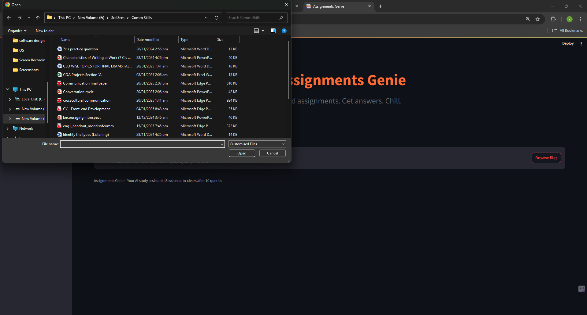
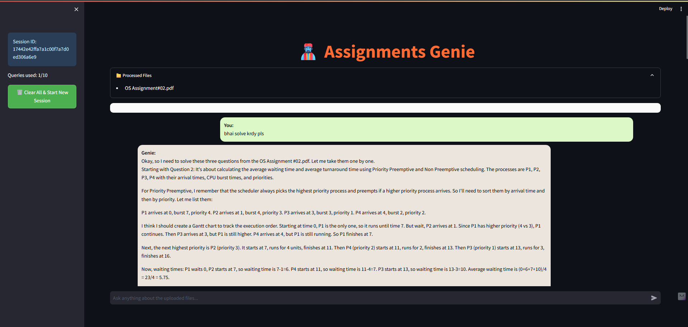
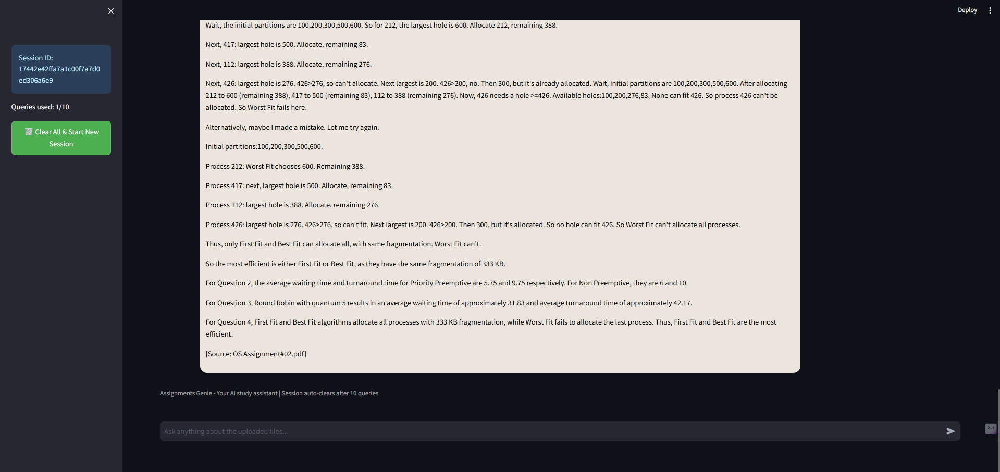

# 📚 Assignments Genie

Assignments Genie is an AI-powered study assistant that helps students quickly find answers from their course materials. Upload your lecture slides, textbooks, and assignments, then ask questions to get instant, context-aware responses.

# SCREENSHOTS

## 🎯 Project Objectives

- **Efficient Document Processing**: Handle multiple file formats (PDF, PPT, DOCX, XLSX, CSV) with robust text extraction
- **Intelligent Question Answering**: Provide accurate, context-aware responses based on uploaded materials
- **User-Friendly Interface**: Create a chat like experience that's intuitive and engaging
- **Session Management**: Implement query limits and session tracking for optimal resource usage
- **Source Attribution**: Clearly show which documents provided the information for each answer

## 🛠️ Tech Stack

- **Python 3.8+**: Core programming language
- **LangChain**: Framework for developing applications with LLMs
- **FAISS**: Vector database for efficient similarity search
- **HuggingFace Embeddings**: Sentence transformers for text embeddings
- **Groq API**: High-performance LLM inference
- **DeepSeek LLM**: Advanced language model for responses

### File Format Support
- 📄 **PDF** (Research papers, textbooks)
- 🖥️ **PPT/PPTX** (Lecture slides, presentations)
- 📝 **DOCX/DOC** (Assignments, notes)
- 📊 **XLSX/XLS** (Data sheets, tables)
- 📋 **CSV** (Structured data)