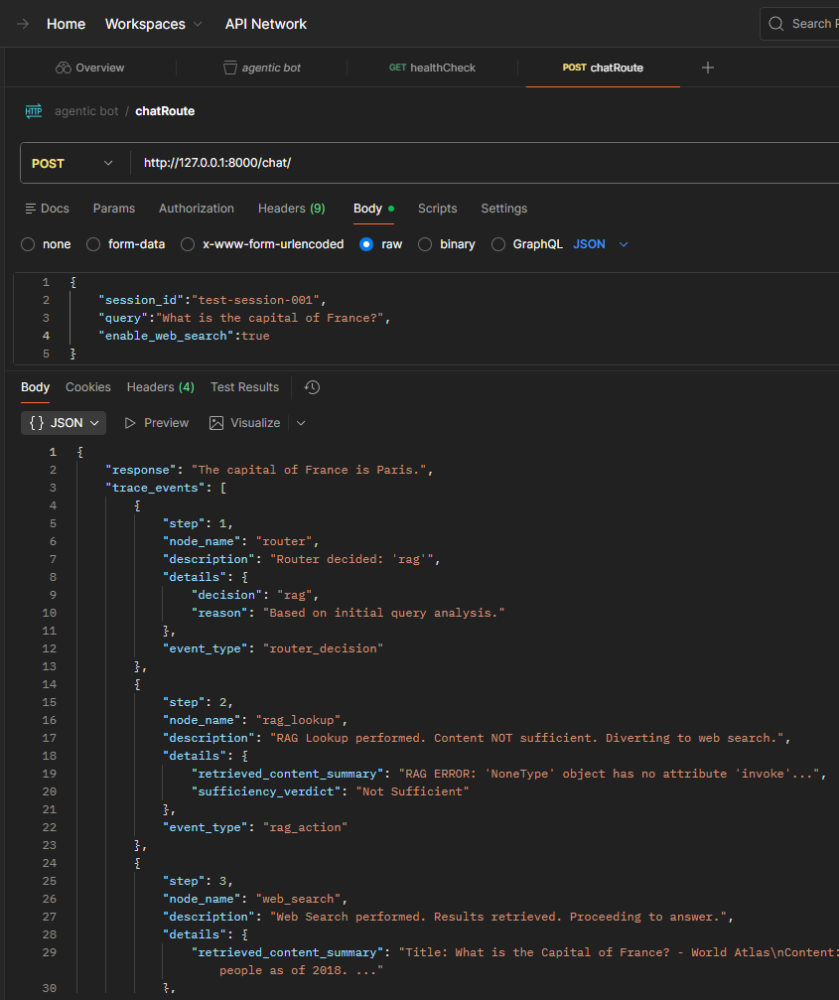
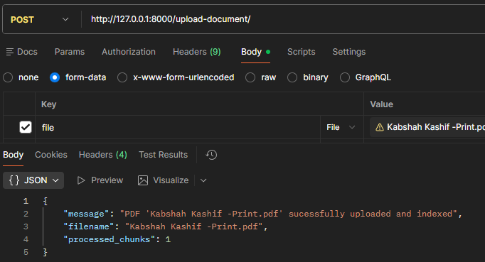
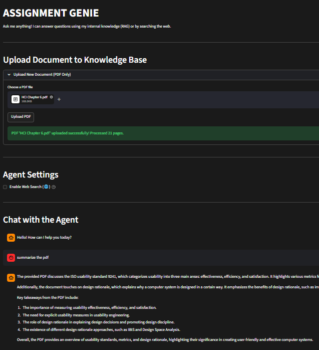
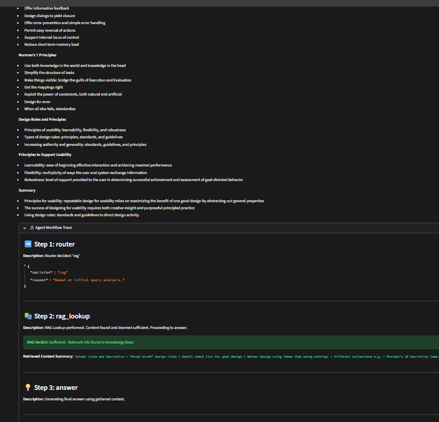

# Agentic RAG Application

This is an AI-powered Retrieval-Augmented Generation application that combines:
- **Backend**: FastAPI server with LangGraph agents for intelligent document processing
- **Frontend**: Streamlit interface for user interaction

## Key Components

### Backend (`backend/`)
- `main.py`: FastAPI application entry point
- `agent.py`: Core LangGraph agent logic
- `vectorstore.py`: Document embedding and storage using Pinecone
- `config.py`: Configuration management

### Frontend (`frontend/`)
- `app.py`: Main Streamlit application
- Supporting modules for UI components, API communication, and session management

## Dependencies
The application uses various AI/ML libraries including:
- LangChain and LangGraph for agent orchestration
- Sentence transformers for text embeddings
- Pinecone for vector storage
- FastAPI and Uvicorn for the API server
- Streamlit for the web interface

## Setup
1. Install dependencies: `poetry install`
2. Configure environment variables in `.env`
3. Run the application: `poetry run uvicorn backend.main:app --reload`

